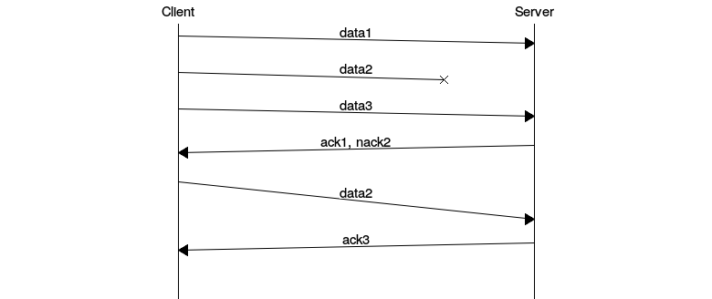
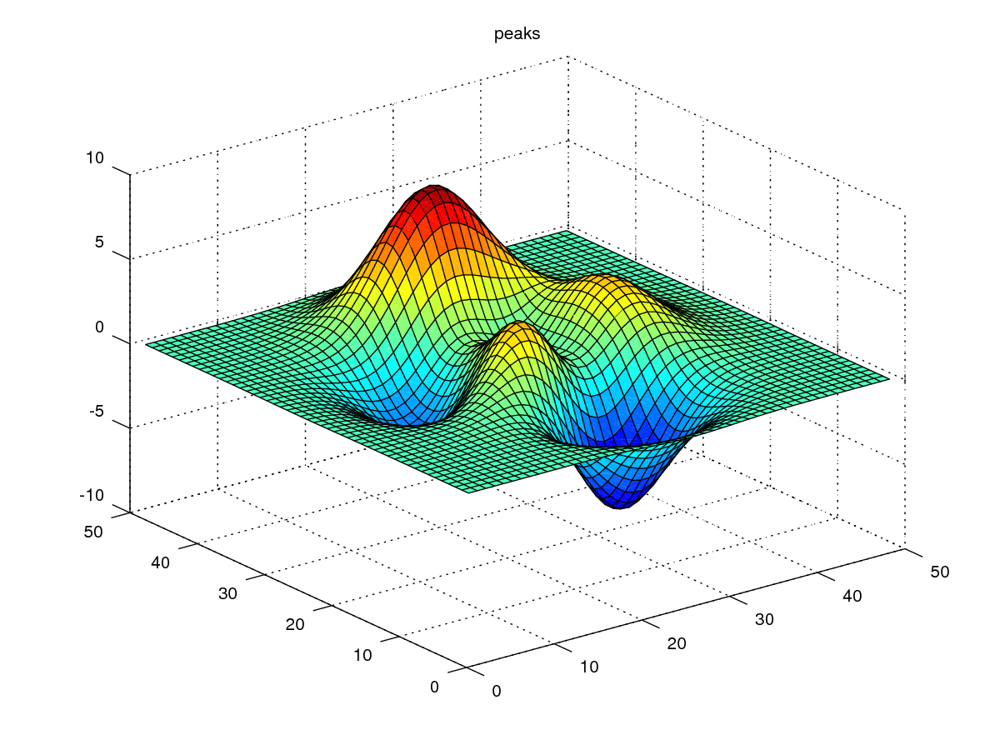
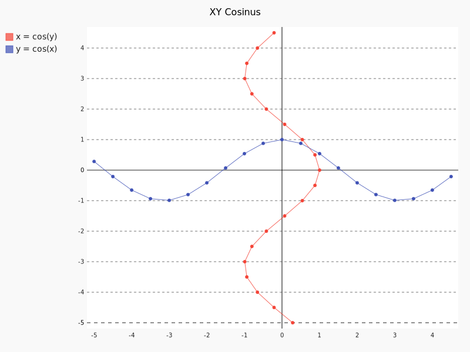

?? missing pd-images/1df4ae1d911b6f65543516954337a570997abc77.png

A pandoc filter to process codeblocks into images and/or ascii art
------------------------------------------------------------------

Imagine is a pandoc filter that will turn codeblocks tagged with certain
classes into images or ascii art. The following are currently supported:

    actdiag, asy, asymptote, blockdiag, boxes, circo, ctioga2, ditaa, dot, fdp,
    figlet, flydraw, gle, gnuplot, graph, graphviz, gri, imagine, mermaid, mscgen,
    neato, nwdiag, octave, packetdiag, pic, pic2plot, plantuml, plot, ploticus,
    protocol, pyxplot, rackdiag, seqdiag, sfdp, shebang, twopi

Examples
--------

### [Mscgen](http://www.mcternan.me.uk/mscgen/)

{imgout="fcb,img"}

### [Octave](https://www.gnu.org/software/octave)

{imgout="fcb,img"}

### [Shebang](http://www.google.com/search?q=linux+shebang) using Python & Pygal

{imgout="fcb,img"}

### [boxes](http://boxes.thomasjensen.com)

?? missing pd-images/def6b187232d420bba6b7afa31c2db0fcf6d3f66.png

More examples in the sample.pdf on
[github](https://github.com/hertogp/imagine).

Documentation
-------------

    Imagine
      A pandoc filter to turn fenced codeblocks into graphics or ascii art by
      wrapping some external command line utilities, such as:

        actdiag, asy, asymptote, blockdiag, boxes, circo, ctioga2, ditaa, dot,
        fdp, figlet, flydraw, gle, gnuplot, graph, graphviz, gri, imagine,
        mermaid, mscgen, neato, nwdiag, octave, packetdiag, pic, pic2plot,
        plantuml, plot, ploticus, protocol, pyxplot, rackdiag, seqdiag, sfdp,
        shebang, twopi


    Installation

        % sudo pip install pandoc-imagine

        or simply save `pandoc-imagine.py` anywhere along $PATH


    Dependencies

        % sudo pip install pandocfilters

        and one (or more) of the packages that provide above utilities.


    Pandoc usage

        % pandoc --filter pandoc-imagine.py document.md -o document.pdf


    Markdown usage

        ```cmd
        code
        ```

      which will run `cmd` (if known) to proces the `code` into a png image and
      replaces the fenced code block with an Image in a paragraph of its own or any
      ascii art in its own CodeBlock.

      Alternate, longer form:

        ```{.cmd options=".." im_out=".." prog=<other-cmd>}
        code
        ```

      - options="..." will be passed onto the command line.
        Some classes already provide some defaults (as required by the command).

      - im_out="...", csv-list of keywords each specifying a certain output
        - img     image in a paragraph
        - fcb     codeblock (class fcb)    containing the original codeblock
        - stdout, codeblock (class stdout) containing stdout output (if any)
        - stderr, codeblock (class stderr) containing stderr output (if any)

      - prog=<other-cmd>, overrides class-to-command map.
        Only useful if `cmd` itself is not an appropiate class in your document.

      If the command fails, the original fenced code block is retained unchanged.
      Any info on stderr is relayed by Imagine, which might be useful for
      troubleshooting.

      If the command succeeds but produces no image, a line reporting the missing
      image is included in the output document.

      Notes:
      - filenames are based on a hash of the codeblock + its attributes
      - uses subdir `pd-images` to store any input/output files
      - there's no clean up of files stored there
      - if an output filename exists, it is not regenerated but simply linked to.
      - `packetdiag` & `sfdp`s underlying libraries seem to have some problems.

      Some commands follow a slightly different pattern:
      - 'img' directive is ignored by commands that only produce ascii
      - ctioga2 defaults to pdf instead of png
      - flydraw produces a gif, not png
      - gle also creates a .gle subdir inside the images-dir
      - gri produces a ps, which is `convert`ed to png
      - imagine reads its code as help-topics, returns codeblocks with help-info
      - plot reads its codeblock as the relative path to the file to process
      - pyxplot will have `set terminal` & `set output` prepended to its `code`
      - shebang runs its codeblock as a script with <fname>.png as its argument.
        - use {.shebang im_out="stdout"} for text instead of an png


    Security

      Imagine just hands the fenced codeblocks to plotting tools to process or
      simply runs them as system scripts, as-is.

      Shebang's are inherently unsafe and most of the plotting tools implement
      their own 'little' languages, which can create beautiful images, but can also
      cause harm.

      There is no way to check for 'side effects' in advance, so make sure to check
      the fenced codeblocks before running them through the filter.


    Imagine class

    The imagine class puts documentation of topics at your fingertips, like so:

        ```imagine
        class
        ```

      Use `imagine` as class to get the module's docstring (ie this text) and/or
      one or more of the commands you're interested in, each on a separate line.

Individual Classes
------------------

?? missing pd-images/27a79df5a7fc06bfd3f424068cde0d8b86643d3c.png
